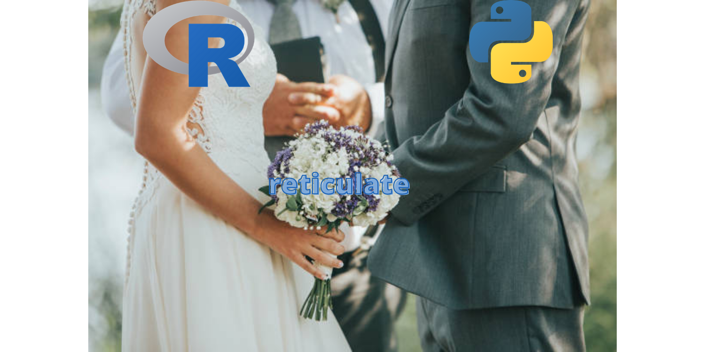
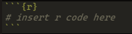
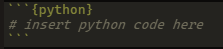

## R Vs Python - Let's make love, not war.

Hello again! It's the holidays and boy, am I glad to be home for a couple of days. I've missed the tranquility and clean-er (than Lagos) air. When last were you home? Go home! And if you're home, happy holidays!

Last week, I released my first R Shiny App - [Twitter Word Cloud App](https://kolaoba.shinyapps.io/TwitterWordCloud), the support was amazing and I have you to thank for that. Analytics of the app usage will be presented to my prospective employers in due time, so thanks once again, you're awesome! Here's a [link](https://kolaobajuluwa.medium.com/twitter-word-clouds-with-r-part-2-a7e10bb1ed1f) to the post talking all about it.

This week, I want to talk about coding in Python...in R.
I'll leave a list of references at the end of the article so permit me to speak in a very concise manner.

## Background

R is a programming language developed by statisticians mostly for data analytics and data mining while Python was developed by a programmer for more general purposes not specifically around data science. In the data science space, R was tailored to suit the needs of analysts with decades of data analysis-centric development and tens of thousands of packages to support this. In Python's defense, it is dubbed "Second best language for everything", this means that it may not be the best tool for every job, but it's versatile enough to handle most programming tasks you need to achieve. That being said, in recent years, Python libraries have been developed to suit the needs of analysts especially in Machine Learning and Artificial Intelligence.


## Team R vs Team Python?

So there's this Team R vs Team Python (Twilight Saga reference) debate all over the interwebs and even a little in a Discord server I'm in (more on that later) but I do not contribute to that, at least not today. Instead of fanning the flames of hysteria, I write today to share the excitement that overwhelmed me when I found out about the "Reticulate" package in R. But if in case you would like to know what team I'm on, you can stick around and find out.

## reticulate

The reticulate package provides an extensive set of tools for interoperability between R and Python, in an R environment. It basically embeds a python session within your R session and lets you get the best of both worlds.

This article is not a technical one to introduce you to the use of the package in the R session, there's loads of that in the interwebs, I'll leave a few in the references. What this article aims to show is how excited I get by these little things. Let me show you.

P.S, If you're uninterested in the code showing this relationship, you can just skip these code chunks and continue in the "All Done" section.

Also in this markdown document, I shall be running code in two types of code chunks, one for R and the other for python. In the background, this is how it looks.





Since knitr (knitr helps convert R markdown to publishable HTML) would hide this part of the chunk, I'll just indicate with comments.

Let's import the package into an R session and I'll show you some things I think are pretty cool about it.

```{r, warning=FALSE}
# this is an r chunk
library(reticulate)
```

I declare a variable in R, R is hospitable, so R welcomes Python to RStudio.

```{r,highlight=TRUE}
# this is an R chunk
hi_python <- "Hello Python,I'm R. You're welcome to RStudio."
```

Then I can call that variable in a Python session using the Python method call where the object (class) is "r".

```{python, warning=FALSE}
# this is a python chunk
print("R says '"+ r.hi_python + "'")
```
It'd be rude not to reply, so let's say hi back in Python.

```{python}
# this is a python chunk
hi_r = "Hello R, I'm Python and I'm glad to be here."
```
Now let's check if R "heard" Python. We do this by accessing the Python variable in the "py" object using R's "$" assessor.

```{r}
# this is an R chunk
print(py$hi_r)
```

## All Done

Ladies and gentlemen, they're connected! You can only imagine my level of excitement when I tried out the code and it worked for the first time. Why was I so excited? Who knows? I guess I was glad that if I ever got stuck in R, I could probably switch to a Python session and go on. I mean, the possibilities are endless!

Now using more advanced functionality from this package, I'm building an Image Classification model using keras and tensorflow and I aim to deploy it as a Shiny App. When will this be? I do not know! But when it's done, you'll be the first to try it out.

Okay then! Thank you for sharing in my excitement this week. So what team am I in R or Python? Well, my answer is yes. You garrit? If you don't garrit, forget abourrit.

Thanks again for reaching this part, you're awesome!. Unfortunately I can't promise anything for next week as my plate is getting full with tasks and a weekly publication may not be sustainable for me, but I can promise to roll out something every other week. Shoutout to Abdulhameed abeg, e no easy. Check out his weekly substack [here](https://hameed.substack.com/), it's always a good read.

Also, the Discord server I mentioned earlier. There's this community of data enthusiasts brought together by Jessica Uwoghiren,  it's called the Data Tech Space. From data engineering all the way to visualization, we come together to share knowledge and help each other grow in our respective fields. You can register [here](https://www.datatechspace.org/register) to be a part of us. It's totally free!

Enjoy the rest of your holidays and catch you guys on the next one (MKBHD reference).

#### References

https://rstudio.github.io/reticulate/

https://www.guru99.com/r-vs-python.html#2

https://www.brodrigues.co/blog/2018-12-30-reticulate/

https://www.r-bloggers.com/2020/01/r-you-ready-for-python-gentle-introduction-to-reticulate-package/

https://en.wikipedia.org/wiki/R_(programming_language)

https://en.wikipedia.org/wiki/Python_(programming_language)


