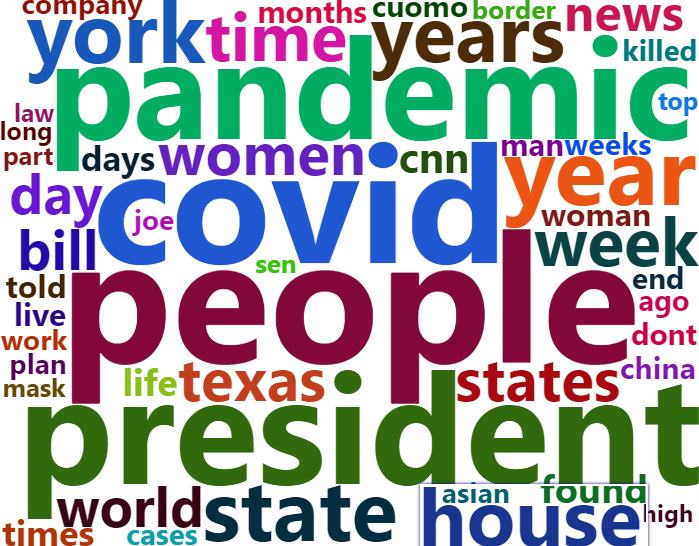
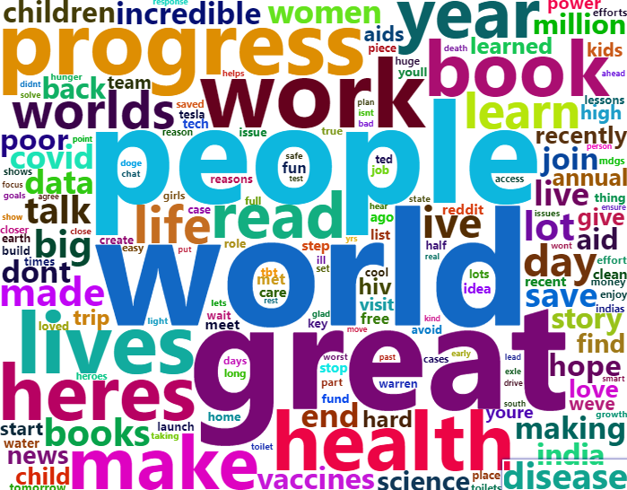

## A Lazy Approach to Tweet Scraping and Some Mild Stalking - Part 1


Last week was super exciting for me after rolling out my first post. I'm grateful for the super positive feedback, especially the encouragement to push out more technical content. Okay, before you scream, I already promised easier-to-read code, so let's proceed.

I was recently messing around with what I could do with my Twitter Developer access for tweet scraping (albeit controlled) and I also recently became fascinated with word clouds.So I decided to marry them into something simple yet useful. 

This article will be a two-part series where the endgame is to build an [R Shiny App](https://shiny.rstudio.com/) for generating word clouds using tweets from any twitter user's timeline. In this part, we'll establish the necessary functions to be used later in the app.

You can get the full code from [my github](https://github.com/kolaoba/R_AirQualityScripts/tree/main/scripts/Twitter_WordClouds) to follow along.

## Step 1: Get your Twitter API Access

This is relatively straightforward, although it could take a couple of days as you have to submit an application to Twitter for their approval. Follow this link to [apply for your Twitter API Access](https://developer.twitter.com/en/apply-for-access). Doing this will give you three things you need later:
1. App - an appName which you create as a project on the twitter developer site
2. consumer_key - an alphanumeric API key provided when you generate a token in your project on the twitter developer site.
3. consumer_secret - same as above but the API secret key instead

## Step 2: Install and load rtweet, wordcloud2 and other Libraries

The rtweet package is available on the CRAN and can be installed with install.packages("rtweet"). You may experience issues installing wordcloud2 from the CRAN so you may want to get it directly from [Lchiffon's github](https://github.com/Lchiffon/wordcloud2)


```{r, warning=FALSE}
# install.packages("rtweet")
library(rtweet) # for scraping tweets
# devtools::install_github("lchiffon/wordcloud2")
library(wordcloud2) # for generating really cool looking wordclouds
library(tm) # for text minning
library(dplyr) # loads of fun stuff including piping
library(RColorBrewer) # colors!
```


## Step 3: Create your Token!
First we have to create a token which gives us access to query the Twitter API for tweets.

```{r, warning=FALSE}
# My details are in my local Renviron file for security.
twitter_token <- create_token(
  app = Sys.getenv("TWITTER_APPNAME"),
  consumer_key = Sys.getenv("TWITTER_API_KEY"),
  consumer_secret = Sys.getenv("TWITTER_API-SECRET_KEY"))
```

Next, using some rather convenient functions from the rtweet package, we can get tweets from individual or multiple timelines. The duration limit enforced by Twitter is for no further back than 7-days. Number of tweets per query is up to 3200 tweets and the rate limits are explained [here](https://developer.twitter.com/en/docs/rate-limits).

## Step 4: Let's Scrape some Tweets!
Using the get_timelines function, we lookup tweets from ColdStoneng and Dominosng simply because I'm hungry right now and could really go for some. We also look up Elon Musk and Bill Gate's timelines for what the money-folk are talking about and some news from cnn and the nytimes.

```{r}
fooood <- get_timelines(c("@coldstoneng","@dominosng"), n= 3200, home=FALSE)
news <- get_timelines(c("@CNN","@nytimes"), n= 3200, home=FALSE)
richpeople <- get_timelines(c("@elonmusk","@BillGates"), n= 3200, home=FALSE)
```

Lets, take a peak at the food tweets


```{r}
names(fooood)
```

Hehe, 90 columns!. This would be rich for some cool analysis but all we want for now is the word cloud so we'll just select the text column and proceed to clean it.
In order to make this short and not so complicated, I'll place most of the code in the next chunk and comment their uses next to them.

```{r, warning=FALSE}
tweets <- fooood # make a copy
tweets <- tweets %>% select("text") # selects just the text column

tweets$text <- gsub("[^[:alnum:][:blank:]?&/\\-]", "",tweets$text) # remove alphanumeric characters 
tweets$text <- gsub("https\\S*", "",tweets$text) # remove hyperlinks
tweets$text <- gsub("amp", "",tweets$text) # amp just keeps showing up, remove it!!

#create a corpus to allow us clean the text column with tm
tweets.corpus <- Corpus(VectorSource(tweets$text))


tweets.corpus <- tweets.corpus %>%
  tm_map(removeNumbers) %>% # removes numbers from text
  tm_map(removePunctuation) %>% # removes punctuation from text
  tm_map(stripWhitespace) %>% # trims the text of whitespace
  tm_map(content_transformer(tolower)) %>% # convert text to lowercase
  tm_map(removeWords,stopwords("english")) %>% # remove stopwords
  tm_map(removeWords,stopwords("SMART")) # remove stopwords not removed from previous line
```

Text should be clean now. Let's make a Term Document Matrix (TDM). Fancy term eh? It really just allows us group the words and get their frequency of occurrence.

```{r}
tdm <- TermDocumentMatrix(tweets.corpus) %>% # create a term document matrix
  as.matrix()

words <- sort(rowSums(tdm), decreasing = TRUE) # count all occurences of each word and group them
df <- data.frame(word = names(words), freq = words) # convert it to a dataframe
head(df) # visualise!
```

Now that that's done, we can generate our first word cloud!

```{r, fig.align= 'center',fig.show='hide'}
set.seed(1234) # for reproducibility, sorta
wcloud <- wordcloud2(df,   # generate word cloud
                     size = 1,
                     color= 'random-dark', # set colors
                     rotateRatio = 0) #horizontal looks better, but what do you think?
wcloud
```


Looks good. Now we can put all the steps into a function so we can generate for any of the categories (food, news or richpeople).
We'll call the function exportWordCloud

```{r}
exportWordCloud <- function(tweet_category){
  tweets <- tweet_category # make a copy
  tweets <- tweets %>% select("text") # selects just the text column
  tweets$text <- gsub("[^[:alnum:][:blank:]?&/\\-]", "",tweets$text) # remove alphanumeric characters 
  tweets$text <- gsub("https\\S*", "",tweets$text) # remove hyperlinks
  tweets$text <- gsub("amp", "",tweets$text) # amp just keeps showing up, remove it!!
  #create a corpus to allow us clean the text column with tm
  tweets.corpus <- Corpus(VectorSource(tweets$text))
  tweets.corpus <- tweets.corpus %>%
    tm_map(removeNumbers) %>% # removes numbers from text
    tm_map(removePunctuation) %>% # removes punctuation from text
    tm_map(stripWhitespace) %>% # trims the text of whitespace
    tm_map(content_transformer(tolower)) %>% # convert text to lowercase
    tm_map(removeWords,stopwords("english")) %>% # remove stopwords
    tm_map(removeWords,stopwords("SMART")) # remove stopwords not removed from previous line
    tdm <- TermDocumentMatrix(tweets.corpus) %>% # create a term document matrix
    as.matrix()
  words <- sort(rowSums(tdm), decreasing = TRUE) # count all occurences of each word and group them
  df <- data.frame(word = names(words), freq = words) # convert it to a dataframe
  set.seed(1234) # for reproducibility, sorta
  wcloud <- wordcloud2(df,   # generate word cloud
                     size = 1,
                     color= 'random-dark', # set colors
                     rotateRatio = 0) #horizontal looks better, but what do you think?
  wcloud
  
}
```

Now we can call it on the other categories

```{r, fig.align='center', warning=FALSE}
exportWordCloud(news)
```


```{r,fig.align='center', warning=FALSE}
exportWordCloud(richpeople)
```


There's so many customizations available for the word clouds check them out [here](https://cran.r-project.org/web/packages/wordcloud2/vignettes/wordcloud.html#lettercloud-function)

Alrighty, this is enough for today!. Next part, we'll build a simple Shiny App around this with some modifications for more personal stalking.

For a more interactive experience, you can check out this same post on [RPubs](https://rpubs.com/kolaoba/twitterwordclouds) 

### Thanks for reading and have a great week ahead!