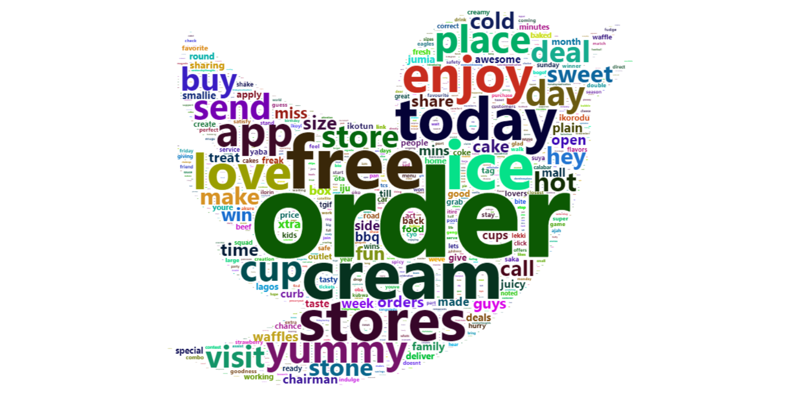
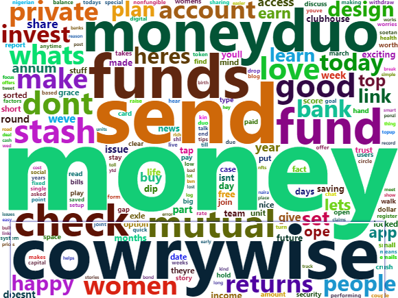

## A Lazy Approach to Tweet Scraping and Some Mild Stalking - Part 2

Hello again! How’d your week go? Mine was busy too! Between Coursera,
Data Engineering projects and work, I may need to subscribe for that
30-hour day plan you mentioned earlier. Hook me up with a link in the
comments, tenk you.

Last week, we introduced generating word clouds from Twitter with R
using the Twitter API. You can check out how this was done on
[Medium](https://kolaobajuluwa.medium.com/twitter-word-clouds-with-r-f72a06c9b540)
and/or [RPubs](https://rpubs.com/kolaoba) for the word cloud
interactivity.

Also last week, I promised we’d build a Shiny App for some mild
stalking. It’d interest you to know that as at the time I wrote last
week’s article, I knew only of the existence of Shiny Apps, nothing
more. That being said, It’s Saturday evening, grab a cup of ice tea and
let’s dive in!

## What’s a Shiny App?

Glad you asked! A quick google search for the [official shiny homepage
link](https://shiny.rstudio.com/) presents us with the following, “Shiny
is an R package that makes it easy to build interactive web apps
straight from R.”

It basically means I can code up all my "magic in R and present a
non-coding end user with an easy-to-use interactive interface for
viewing my analysis.

In the spirit of this, there is not one single line of code in this
article.

The official website offers many ways to learn how to build them, check
them out [here](https://shiny.rstudio.com/)

## Let’s Stalk Someone

So I took last week’s exportWordCloud function, tweaked it a little, fed
it into the app’s architecture and I present you with the stalker app,
as promised.

With this app, you can look up any twitter user’s handle to generate a
word cloud of their last 1000 tweets. Gives you an idea of what they’ve
been talking about, hehehe.

It’s really easy to build and I’ll leave the code in my
[github](https://github.com/kolaoba/R_Projects/tree/main/apps/TwitterWordCloud)
in case you want to reproduce for yourself. Get your twitter API access
first!

Please check out the app here. Its default page is the coldstone word
cloud (because, why not?) but you can look up your crush too.

It’s pretty simple for now as I literally just looked up how to build it
this morning, but in subsequent posts, I could add much more
functionality and make it even cooler!

Next week, I’m hosting a wedding ceremony for R and Python in my RStudio
and you’re invited!. We’ll explore some of the cool features you can
utilize when they’re both in the same space.

Have a restful weekend ahead!

I leave you with the following words from looking up @cowrywise with my
app. When you see it. 
