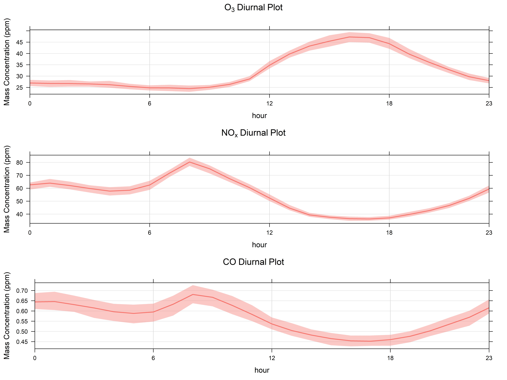

## Welcome

This workbook seeks to aid R beginners in understanding how to dive into R objects to find all the gold they need.

We'll be working with some air quality data I found on kaggle, it covers air quality in India from 2015 to 2020. Here's a link to the dataset: https://www.kaggle.com/rohanrao/air-quality-data-in-india

Downloaded the data? let's load it.


```{r}
wkdir <- "C:/Users/koli0/Downloads/Compressed/archive/"

csvs <- list.files(path = wkdir, pattern = "*.csv")

csvs
```
We want granular data, at least time-wise, so let's go with the hourly data. I'm not focusing on spatial variation now so I'll just load the data by city (city_hour.csv) and have a quick glance at it.

```{r}
testr1 <- read.csv(paste(wkdir,csvs[2],sep =""))
head(testr1)
```
Let's take a look at the unique cities as we do not need ALL the data for this.


```{r}
unique(testr1$City)
```
Let's filter the data to cover just Mumbai. We'll need the "dplyr" package for this.
```{r, results='hide'}
library(dplyr)
mumbai_aq <- filter(testr1, City == "Mumbai" )
```
Let's get a list of it's headers using the names function

```{r}
names(mumbai_aq)
```
This is pretty basic use of names, getting the headers in a dataframe. This simple feature can unlock so much more. Let's go!

Let's obtain diurnal plots of O3, Nox and CO, they theoretically have a chemical relationship but that isn't in the scope of this post.

To get these plots, we'll be using an awesome package from David Carslaw called "openair". It's a neat package for air quality analysis. you can install using install.packages("openair") or you can get it directly from his github. I'll load it below since i have it installed already.

```{r, results='hide'}
library(openair)
```
To properly analyse time-series data using the openair package, we need to establish a date column of the POSIXct type. let's do this for our DateTime column as it's currently a character column

```{r}
mumbai_aq$date <- as.POSIXct(mumbai_aq$Datetime, tz = "GMT", "%Y-%m-%d %H:%M:%S")
class(mumbai_aq$date)
```
For the diurnal plots, we'll be using the timeVariation function in the openair package. It plots the diurnal, day of the week and monthly variation plots for different pollutants.

Let's plot for Nox

```{r}
nox_plt <- timeVariation(mumbai_aq, pollutant = 'NOx')
```
Let's check the variable

```{r}
nox_plt
```
Okay. Our diurnal plot is in the bottom left, "sitting pretty". We want this plot to stand alone as we aim to compare with similar plots for two other pollutants. Documentation for the openair package shows us how to obtain individual plots using the subset function, let's try it.

```{r}
plot(nox_plt, subset = "hour")
```
Awesome! Now let' assign it to a variable.

```{r, fig.show='hide'}
nox_plt_hr <- plot(nox_plt, subset = "hour")
```
Let's Check the variable

```{r}
nox_plt_hr
```
Uh-oh! It doesn't appear to store the plot to a variable.

In situations like this, we may want to look deeper into our variables to see what they actually are. This is where the power of "names" shines. Let's start from the timeVariation plot.

```{r}
names(nox_plt)
```
The timeVariation plot is an openair object which contains three items.
Object items can be referenced easily in R with [[]]. So let's look further into the plot item.

```{r}
names(nox_plt[["plot"]])
```
Aha! We seem to have found the items that constituted the initial timeVariation plot.
Our plot of interest is the diurnal plot titled "hour".

Let's try to store the plot to a variable using this referencing
```{r}
nox_plt_hr <- nox_plt[["plot"]][["hour"]]
```
Quick check to see if it's stored.

```{r}
nox_plt_hr
```
Awesome! so our plot is stored and we can replicate this for our other pollutants.

```{r, fig.show='hide'}
co_plt <- timeVariation(mumbai_aq, pollutant = 'CO')
co_plt_hr <- co_plt[["plot"]][["hour"]]

o3_plt <- timeVariation(mumbai_aq, pollutant = 'O3')
o3_plt_hr <- o3_plt[["plot"]][["hour"]]
```
## Editing the Plot Components

These plots are generated for us by the timeVariation function and as such we may not be able to edit its components (labels, axes, limits etc), Or can we?!

Let's see if we are able to reference the plot object any further using the names function.

```{r}
names(nox_plt_hr)
```
Aha! This gives all the components of the plot. Asides from being an accessor function, it's also a replacement function when used with "<-"

Let's see what that means. We'll add titles ("main") to the diurnal plots and also change their y axis labels ("ylab")

```{r}
nox_plt_hr[["main"]] <- bquote(NO[x]~Diurnal~Plot)
nox_plt_hr[["ylab"]] <- "Mass Concentration (ppm)"
o3_plt_hr[["main"]] <- bquote(O[3]~Diurnal~Plot)
o3_plt_hr[["ylab"]] <- "Mass Concentration (ppm)"
co_plt_hr[["main"]] <- bquote(CO~Diurnal~Plot)
co_plt_hr[["ylab"]] <- "Mass Concentration (ppm)"
```

Awesome!

Let's export the three plots stacked atop one another.

```{r, results = 'hide'}
jpeg(file="diurnplot.jpeg", res=700, width=8000, height=6000, pointsize=10,
     type="windows", antialias="cleartype")
# 2. Create a plot
print(o3_plt_hr, position = c(0, 0.67, 1, 1), more = TRUE)
print(nox_plt_hr, position = c(0, 0.33, 1, 0.67),more = TRUE)
print(co_plt_hr, position = c(0, 0, 1, 0.33))
#Close plot
dev.off()
```


---
#
---
I may have rushed you at the end there with the print statements but we'll explore stacking plots in  another post.

Thanks for reading!


