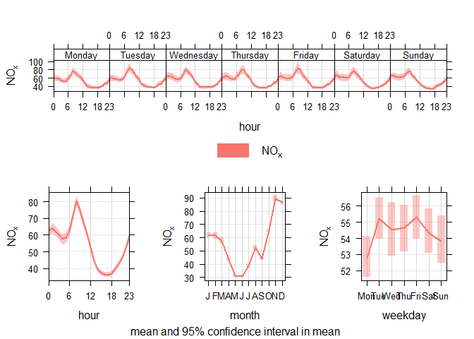
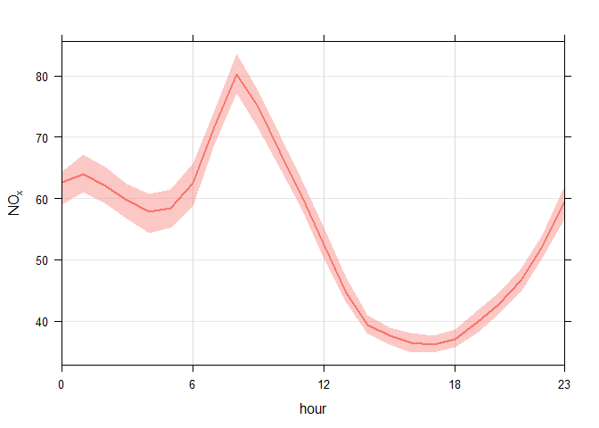
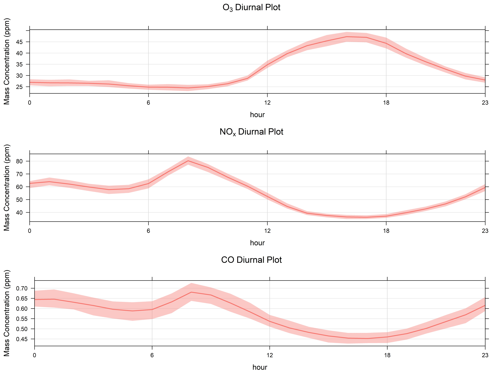

## Hi! What’s your name?

The names function in R is a simple yet powerful function for accessing
and even replacing “names” of attributes of vectors and objects.

To illustrate this, we’ll be working with some air quality data from
kaggle, it covers air quality in India from 2015 to 2020. Here’s a link
to the dataset:
<https://www.kaggle.com/rohanrao/air-quality-data-in-india>

Downloaded the data? Let’s load it.

``` r
wkdir <- "C:/Users/koli0/Downloads/Compressed/archive/"

csvs <- list.files(path = wkdir, pattern = "*.csv")

csvs
```

    ## [1] "city_day.csv"     "city_hour.csv"    "station_day.csv"  "station_hour.csv" "stations.csv"

We want granular data, at least time-wise, so let’s go with the hourly
data. We’re not focusing on spatial variation right now so let’s load
the data by city (city_hour.csv) and have a quick glance at it.

``` r
testr1 <- read.csv(paste(wkdir,csvs[2],sep =""))
head(testr1)
```

    ##        City            Datetime PM2.5 PM10   NO   NO2   NOx NH3   CO    SO2     O3 Benzene Toluene Xylene
    ## 1 Ahmedabad 2015-01-01 01:00:00    NA   NA 1.00 40.01 36.37  NA 1.00 122.07     NA       0       0      0
    ## 2 Ahmedabad 2015-01-01 02:00:00    NA   NA 0.02 27.75 19.73  NA 0.02  85.90     NA       0       0      0
    ## 3 Ahmedabad 2015-01-01 03:00:00    NA   NA 0.08 19.32 11.08  NA 0.08  52.83     NA       0       0      0
    ## 4 Ahmedabad 2015-01-01 04:00:00    NA   NA 0.30 16.45  9.20  NA 0.30  39.53 153.58       0       0      0
    ## 5 Ahmedabad 2015-01-01 05:00:00    NA   NA 0.12 14.90  7.85  NA 0.12  32.63     NA       0       0      0
    ## 6 Ahmedabad 2015-01-01 06:00:00    NA   NA 0.33 15.95 10.82  NA 0.33  29.87  64.25       0       0      0
    ##   AQI AQI_Bucket
    ## 1  NA           
    ## 2  NA           
    ## 3  NA           
    ## 4  NA           
    ## 5  NA           
    ## 6  NA

Now we’ll take a look at the unique cities as we do not need ALL the
data for this.

``` r
unique(testr1$City)
```

    ##  [1] "Ahmedabad"          "Aizawl"             "Amaravati"          "Amritsar"          
    ##  [5] "Bengaluru"          "Bhopal"             "Brajrajnagar"       "Chandigarh"        
    ##  [9] "Chennai"            "Coimbatore"         "Delhi"              "Ernakulam"         
    ## [13] "Gurugram"           "Guwahati"           "Hyderabad"          "Jaipur"            
    ## [17] "Jorapokhar"         "Kochi"              "Kolkata"            "Lucknow"           
    ## [21] "Mumbai"             "Patna"              "Shillong"           "Talcher"           
    ## [25] "Thiruvananthapuram" "Visakhapatnam"

Let’s filter the data to cover just Mumbai. We’ll need the “dplyr”
package for this.

``` r
library(dplyr)
mumbai_aq <- filter(testr1, City == "Mumbai" )
```

Let’s get a list of its headers using the names function

``` r
names(mumbai_aq)
```

    ##  [1] "City"       "Datetime"   "PM2.5"      "PM10"       "NO"         "NO2"        "NOx"       
    ##  [8] "NH3"        "CO"         "SO2"        "O3"         "Benzene"    "Toluene"    "Xylene"    
    ## [15] "AQI"        "AQI_Bucket"

This is pretty basic use of names; getting the headers in a dataframe.
This simple feature can unlock so much more. Let’s go!

Next, we will generate diurnal plots of O3, Nox and CO, they
theoretically have a chemical relationship but that isn’t within the
scope of this post.

To get these plots, we’ll be using an awesome package from David Carslaw
called “openair”. It’s a neat package for air quality analysis. You can
install using install.packages(“openair”) or you can get it directly
from his github. I’ll load it below since i have it installed already.

``` r
library(openair)
```

To properly analyse time-series data using the openair package, we need
to establish a date column of the POSIXct type. So we do this from our
DateTime column as it’s currently a character column

``` r
mumbai_aq$date <- as.POSIXct(mumbai_aq$Datetime, tz = "GMT", "%Y-%m-%d %H:%M:%S")
class(mumbai_aq$date)
```

    ## [1] "POSIXct" "POSIXt"

For the diurnal plots, we’ll be using the timeVariation function in the
openair package. It plots the diurnal, day of the week and monthly
variation plots for different pollutants.

Let’s plot for Nox

``` r
nox_plt <- timeVariation(mumbai_aq, pollutant = 'NOx')
```


Let’s check the variable

``` r
nox_plt
```

    ## 
    ## openair object created by:
    ##  timeVariation(mydata = mumbai_aq, pollutant = "NOx")

    ## 
    ## this contains:

    ##  4 data frame(s):

    ##  $data$day.hour, $data$hour, $data$day, $data$month

    ##  4 plot objects(s):

    ##  $plot$day.hour, $plot$hour, $plot$day, $plot$month

    ## 


Okay. Our diurnal plot is in the bottom left, “sitting pretty”. We want
this plot to stand alone as we aim to compare with similar plots for two
other pollutants. Documentation for the openair package shows us how to
obtain individual plots using the subset function, let’s try it out.

``` r
plot(nox_plt, subset = "hour")
```


Awesome! Now let’s assign this plot to a variable.

``` r
nox_plt_hr <- plot(nox_plt, subset = "hour")
```

Checking the variable

``` r
nox_plt_hr
```

    ## NULL

Uh-oh! It doesn’t appear to store the plot to a variable.

In situations like this, we may want to look deeper into our variables
to see what they actually are. This is where the power of “names”
shines. Let’s start from the timeVariation plot.

``` r
names(nox_plt)
```

    ## [1] "plot" "data" "call"

The timeVariation plot is an openair object which contains three items.
Object items can be referenced easily in R with \[\[\]\]. So let’s look
further into the plot item.

``` r
names(nox_plt[["plot"]])
```

    ## [1] "day.hour" "hour"     "day"      "month"    "subsets"

Aha! We seem to have found the items that constituted the initial
timeVariation plot. Our plot of interest is the diurnal plot titled
“hour”.

Let’s try to store the plot to a variable using this referencing

``` r
nox_plt_hr <- nox_plt[["plot"]][["hour"]]
```

Quick check to see if it’s stored.

``` r
nox_plt_hr
```


Awesome! so our plot is stored and we can replicate this for our other
pollutants.

``` r
co_plt <- timeVariation(mumbai_aq, pollutant = 'CO')
```

``` r
co_plt_hr <- co_plt[["plot"]][["hour"]]

o3_plt <- timeVariation(mumbai_aq, pollutant = 'O3')
```

``` r
o3_plt_hr <- o3_plt[["plot"]][["hour"]]
```

## Editing the Plot Components

These plots are generated for us by the timeVariation function and as
such, we may not be able to edit its components (labels, axes, limits
etc), Or can we?!

Let’s see if we are able to reference the plot object any further using
the names function.

``` r
names(nox_plt_hr)
```

    ##  [1] "formula"           "as.table"          "aspect.fill"       "legend"            "panel"            
    ##  [6] "page"              "layout"            "skip"              "strip"             "strip.left"       
    ## [11] "xscale.components" "yscale.components" "axis"              "xlab"              "ylab"             
    ## [16] "xlab.default"      "ylab.default"      "xlab.top"          "ylab.right"        "main"             
    ## [21] "sub"               "x.between"         "y.between"         "par.settings"      "plot.args"        
    ## [26] "lattice.options"   "par.strip.text"    "index.cond"        "perm.cond"         "condlevels"       
    ## [31] "call"              "x.scales"          "y.scales"          "panel.args.common" "panel.args"       
    ## [36] "packet.sizes"      "x.limits"          "y.limits"          "x.used.at"         "y.used.at"        
    ## [41] "x.num.limit"       "y.num.limit"       "aspect.ratio"      "prepanel.default"  "prepanel"

Aha! This gives all the components of the plot. Asides from being an
accessor function, it’s also a replacement function when used with “\<-”

Let’s see what that means. We’ll add titles (“main”) to the diurnal
plots and also change their y-axis labels (“ylab”)

``` r
nox_plt_hr[["main"]] <- bquote(NO[x]~Diurnal~Plot)
nox_plt_hr[["ylab"]] <- "Mass Concentration (ppm)"
o3_plt_hr[["main"]] <- bquote(O[3]~Diurnal~Plot)
o3_plt_hr[["ylab"]] <- "Mass Concentration (ppm)"
co_plt_hr[["main"]] <- bquote(CO~Diurnal~Plot)
co_plt_hr[["ylab"]] <- "Mass Concentration (ppm)"
```

Awesome!

Let’s export the three plots stacked atop one another.

``` r
jpeg(file="../plots/diurnplot.jpeg", res=700, width=8000, height=6000, pointsize=10,
     type="windows", antialias="cleartype")
# 2. Create a plot
print(o3_plt_hr, position = c(0, 0.67, 1, 1), more = TRUE)
print(nox_plt_hr, position = c(0, 0.33, 1, 0.67),more = TRUE)
print(co_plt_hr, position = c(0, 0, 1, 0.33))
#Close plot
dev.off()
```

|                                                                                                  |
|--------------------------------------------------------------------------------------------------|
|  |

I may have rushed you at the end there with the print statements but
we’ll explore stacking plots in another post.

Thanks for reading!
